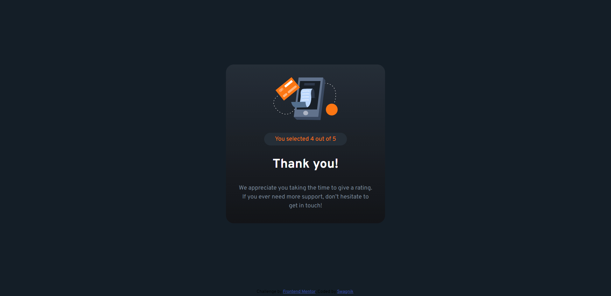

# Frontend Mentor - Interactive rating component solution

## Table of contents

- [Overview](#overview)
  - [The challenge](#the-challenge)
  - [Screenshot](#screenshot)
- [My process](#my-process)
  - [Built with](#built-with)
  - [What I learned](#what-i-learned)
  - [Useful resources](#useful-resources)
- [Author](#author)
- [Acknowledgments](#acknowledgments)

## Overview
This is a solution to the [Interactive rating component challenge on Frontend Mentor](https://www.frontendmentor.io/challenges/interactive-rating-component-koxpeBUmI). It is a very beginner friendly and drilling challenge, where one can learn how to incorporate js with html and css works. 

### The challenge

Users should be able to:

- View the optimal layout for the app depending on their device's screen size
- See hover states for all interactive elements on the page
- Select and submit a number rating
- See the "Thank you" card state after submitting a rating

### Screenshot

Rating card ss-

Thank You card ss-

## My process

First job was to disect the design and learn what kind of styles are used, when the transitions will happen, UX of the design, etc. As a second step, creation of widget/ component tree was done. It's very critical as this will complete 50% of the job. Post completion of design learning process, it's all about css styling and js works.

### Built with

I used vanilla js, custom css and html 5 for this challenge. Although react js would have made life easier, I chose not to (just for fun sake and also, because I'm still learning it :) ).

### What I learned

So many things I learned with this challenge.
- use of flex box
- custom button styling
- centering divs
- hover and focus effects
- using js to inject text in html document
- button event listening and management

### Useful resources

-[W3 school](https://www.w3schools.com/tags/tag_button.asp) -button styling
-[W3 school](https://www.w3schools.com/cssref/sel_hover.php) -:hover effect 

## Author

- LinkedIn [Swagnik Das](https://www.linkedin.com/in/swagnikdas/)
- GitHub [swagthehooman](https://github.com/swagthehooman)
- Frontend Mentor [Swagnik Das](https://www.frontendmentor.io/profile/swagthehooman)

## Acknowlegment

I'd like to thank my friends for their support and helping hand in completion of this challenge.